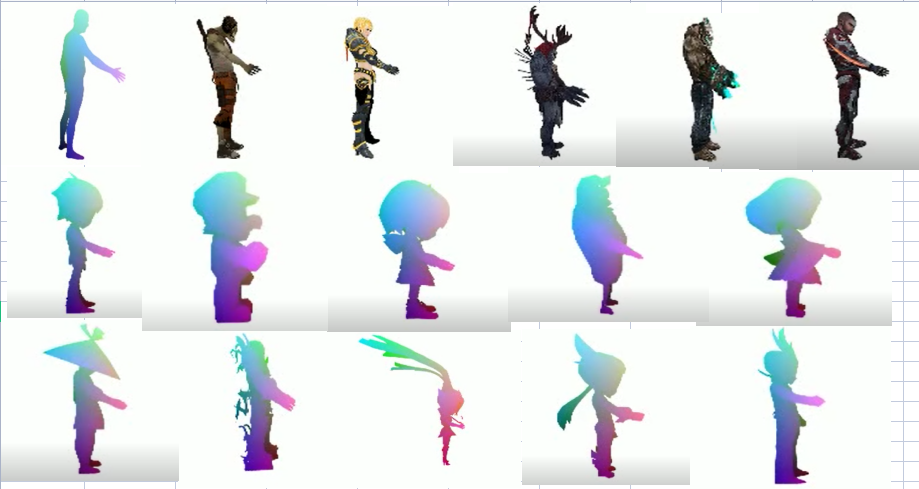

# Pose2Carton 

EE228 课程大作业 利用3D骨架控制3D卡通人物 (https://github.com/yuzhenbo/pose2carton) 

数据组别： 16

数据类型： 10组匹配 + 5组蒙皮

# Maya 环境配置

下载Maya教育版，安装后将……/Maya2022/bin添加到系统环境变量，该目录下应该包括mayapy，在终端中即可运行mayapy，对于一些IDE也可以手动选择mayapy作为解释器来运行代码。
在终端输入命令curl https://bootstrap.pypa.io/pip/2.7/get-pip.py -o get-pip.py mayapy get-pip.py 以安装pip。
在此基础上使用mayapy -m pip install 可以安装一些python库，如numpy。

# 匹配流程

1.对于从网上下载的模型需要进行此步，对于提供的obj和txt跳过此步骤。将fbx_parser.py中的第166行代码文件路径改为相应fbx模型的路径，选择mayapy作为解释器后运行fbx_parser.py
可以得到obj格式的模型，包含joint和skin信息的txt文件，以及帮助贴皮的mtl文件和贴皮fbm文件夹（包含png贴皮）。

2.将transfer.py中main函数部分做合适的修改：如果用到网上下载的模型，则运行# for possible model downloaded online 注释下的代码并更改相应路径。对于提供的模型，则运行# for provided models下的代码并更改相应路径。运行时需要给出变量manual_model_to_smpl的对应关系，需要根据对应关节名和空间结构来匹配，如{0: 0, 1: 3, 2: 2, 3: 1, 4: 6, 5: 5, 6: 4, 7: 9, 8: 8, 9: 7, 10: 12, 11: 14, 12: 13, 21: 19, 22: 18, 23: 21, 24: 20, 16: 17, 17: 16}，可以利用maya或blender来协助匹配。也可以令manual_model_to_smpl={}，从而进行自动匹配。我们小组对自动匹配进行了改进，能够对更多形式的关节命名也能匹配，详细内容参考代码_lazy_get_model_to_smpl()函数和报告。

3.将mtl文件和贴皮的png放在obj_seq_5_3dmodel文件夹中，运行vis.py可视化。对于从网上下载的模型，需要设置其中全局变量use_online_model = True。

# 新增脚本说明

# 项目结果

# 协议 
本项目在 Apache-2.0 协议下开源

所涉及代码及数据的最终解释权归倪冰冰老师课题组所有
